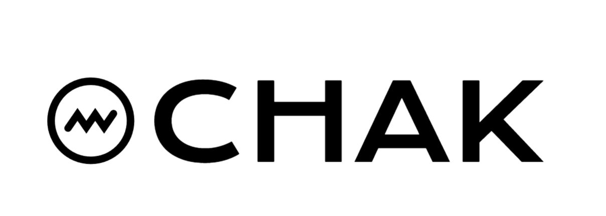

# chak

<div align="center">

[](https://youtube.com/watch?v=xOKQ7EQcggw)

[English](README.md) | [中文](docs/README_CN.md)

A multi-model LLM client with built-in context management.

chak is not another one-api or OpenRouter, but a client library that actively manages conversation context for you. Just focus on the conversation, let chak handle the context engineering.

</div>

---

## Core Features

**1. Built-in Context Management**

Context management is chak's core capability. It provides multiple strategies (FIFO, Summarization, LRU) to automatically handle conversation history, maintaining complete records while saving token costs. You focus on conversations, chak handles the context.

**2. Concise URI Invocation**

Connect to mainstream models globally with one line of code, no need to remember complex SDK configurations:

```python
# Simple format (recommended)
conv = chak.Conversation("openai/gpt-4o-mini", api_key="YOUR_KEY")

# Complete format (custom base_url)
conv = chak.Conversation("deepseek@https://api.deepseek.com:deepseek-chat", api_key="YOUR_KEY")
```

**3. Short-term Memory → Long-term Memory**

- Now: Short-term memory management (FIFO truncation, Summarization, LRU forgetting), ready to use
- Future: Long-term memory capabilities (RAG, memory bank), making conversations truly "memorable", in planning

---

## Integrated Providers (18+)

OpenAI, Google Gemini, Azure OpenAI, Anthropic Claude, Alibaba Bailian, Baidu Wenxin, Tencent Hunyuan, ByteDance Doubao, Zhipu GLM, Moonshot, DeepSeek, iFlytek Spark, MiniMax, Mistral, SiliconFlow, xAI Grok, Ollama, vLLM, and more.

---

## Quick Start

### Installation

```bash
pip install chak
```

### Chat with global models in a few lines

```python
import chak

conv = chak.Conversation(
    "openai/gpt-4o-mini",
    api_key="YOUR_KEY"
)

resp = conv.send("Explain context management in one sentence")
print(resp.content)
```

chak handles: connection initialization, message alignment, retry logic, context management, model format conversion... You just need to `send` messages.

---

## Enable Automatic Context Management

### Strategy A: `FIFOStrategy` - Keep Recent N Turns

Suitable for fast-paced conversations, like a rolling window keeping conversations fresh:

```python
from chak import Conversation, FIFOStrategy

conv = Conversation(
    "deepseek/deepseek-chat",
    api_key="YOUR_KEY",
    context_strategy=FIFOStrategy(
        keep_recent_turns=3,       # Keep only the last 3 turns
        max_input_tokens=120_000   # Context window size
    )
)
```

**Parameters:**
- `keep_recent_turns`: How many recent turns to keep? A turn = all content from one user message to the next user message.
- `max_input_tokens`: Set a "stomach capacity" limit for the strategy, ensuring it won't overflow the model's context window.

How it works: The strategy inserts a truncation marker before the retention interval, sending only content after the marker. Original conversation? All preserved in `conversation.messages`.

### Strategy B: `SummarizationStrategy` - Smart History Summarization

Suitable for long conversations, like a thoughtful summarization assistant:

```python
from chak import Conversation, SummarizationStrategy

conv = Conversation(
    "openai/gpt-5",
    api_key="YOUR_KEY",
    context_strategy=SummarizationStrategy(
        max_input_tokens=128_000,            # Context window size
        summarize_threshold=0.75,            # Trigger threshold
        prefer_recent_turns=2,               # Keep recent turns
        summarizer_model_uri="openai/gpt-4o-mini",  # Summarizer model
        summarizer_api_key="YOUR_KEY"
    )
)
```

**Parameters:**
- `max_input_tokens`: How large is your model's context window? The strategy uses this to decide when to trigger.
- `summarize_threshold`: At what percentage of the window should summarization trigger? 0.75 = 75%, leaving room for future conversation.
- `prefer_recent_turns`: Keep the last few turns untouched to maintain the "live feel" of the conversation.
- `summarizer_model_uri` / `summarizer_api_key`: Which model to use for summarization? Can be the same as main conversation or a cheaper one.

**How it works:**

When conversations accumulate to a certain length, chak automatically triggers summarization. It condenses early conversations into key points and inserts a marker into the message chain. Subsequent sends only include this marker and content after it. This preserves complete history while significantly reducing actual tokens sent, allowing you to continue conversations without worrying about context window size.

Original conversations remain fully preserved in `conversation.messages`, ready for viewing, export, or analysis anytime.

### Strategy C: `LRUStrategy` - Smart Cold Topic Forgetting

Suitable for long conversations with topic jumps, automatically fades out topics no longer discussed, preserving hot content:

```python
from chak import Conversation, LRUStrategy

conv = Conversation(
    "deepseek/deepseek-chat",
    api_key="YOUR_KEY",
    context_strategy=LRUStrategy(
        max_input_tokens=128_000,            # Context window size
        summarize_threshold=0.75,            # Trigger threshold
        prefer_recent_turns=2,               # Keep recent turns
        summarizer_model_uri="deepseek/deepseek-chat", # Summarizer model
        summarizer_api_key="YOUR_KEY"
    )
)
```

**Parameters:**
- Same parameters as `SummarizationStrategy`, usage is identical
- Internal enhancement: Based on Summarization strategy, additionally analyzes the last 5 summary markers
- Smart forgetting: Detects which topics are no longer discussed, automatically fades cold topics, reinforces hot content

**How it works:**

1. First works like `SummarizationStrategy`, generating summary markers
2. When summary markers accumulate to a certain amount, LRU enhancement activates
3. Analyzes the last 5 markers, identifying "hot topics" (continuously discussed) and "cold topics" (no longer mentioned)
4. Creates LRU markers, keeping only hot topic content, fading cold topics
5. Original summary markers and complete history remain preserved for viewing anytime

**Use cases:**
- Conversations with frequent topic switches (e.g., Python → Java → Machine Learning)
- Long conversations focusing only on current discussion topics
- Want the model to "forget" early irrelevant topics, focusing on current task

---

## Practical Utilities

### View Conversation Statistics

```python
stats = conv.stats()
print(stats)
# {
#     'total_messages': 10,
#     'by_type': {'user': 5, 'assistant': 4, 'context': 1},
#     'total_tokens': '12.5K',
#     'input_tokens': '8.2K',
#     'output_tokens': '4.3K'
# }
```

### Debug Strategy Behavior

Set environment variables to see strategy internals:

```bash
export CHAK_LOG_LEVEL=DEBUG
python your_script.py
```

chak will output detailed strategy execution logs: trigger points, retention intervals, summary previews, etc.

---

## Local Server Mode (Optional)

Start a local gateway service with 2 lines of code:

### 1. Create Configuration File

```yaml
# chak-config.yaml
api_keys:
  # Simple format - use default base_url
  openai: ${OPENAI_API_KEY}           # Read from environment variable (recommended)
  bailian: "sk-your-api-key-here"    # Plain text (for development/testing)
  
  # Custom base_url (requires quotes)
  "ollama@http://localhost:11434": "ollama"
  "vllm@http://192.168.1.100:8000": "dummy-key"

server:
  host: "0.0.0.0"
  port: 8000
```

### 2. Start Server

```python
import chak

chak.serve('chak-config.yaml')
```

That's it! The server starts and you'll see:

```
======================================================================

  ✨ Chak AI Gateway
  A simple, yet handy, LLM gateway

======================================================================

  🚀 Server running at:     http://localhost:8000
  🎮 Playground:            http://localhost:8000/playground
  📡 WebSocket endpoint:    ws://localhost:8000/ws/conversation

  ⭐ Star on GitHub:        https://github.com/zhixiangxue/chak-ai

======================================================================
```

### 3. Use Playground for Quick Model Conversations

Open `http://localhost:8000/playground`, select a provider and model, start chatting immediately. Experience real-time interaction with global LLMs.

### 4. Call from Any Language

The service provides a WebSocket API, callable from JavaScript, Go, Java, Rust, or any language:

```javascript
// JavaScript example
const ws = new WebSocket('ws://localhost:8000/ws/conversation');

// Initialize session
ws.send(JSON.stringify({
  type: 'init',
  model_uri: 'openai/gpt-4o-mini'
}));

// Send message
ws.send(JSON.stringify({
  type: 'send',
  message: 'Hello!',
  stream: true
}));
```

This way chak becomes your local LLM gateway, centrally managing all provider API keys, callable from any language.

---

## Supported LLM Providers

| Provider | Registration | URI Example |
|----------|-------------|-------------|
| OpenAI | https://platform.openai.com | `openai/gpt-4o` |
| Anthropic | https://console.anthropic.com | `anthropic/claude-3-5-sonnet` |
| Google Gemini | https://ai.google.dev | `google/gemini-1.5-pro` |
| DeepSeek | https://platform.deepseek.com | `deepseek/deepseek-chat` |
| Alibaba Bailian | https://bailian.console.aliyun.com | `bailian/qwen-max` |
| Zhipu GLM | https://open.bigmodel.cn | `zhipu/glm-4` |
| Moonshot | https://platform.moonshot.cn | `moonshot/moonshot-v1-8k` |
| Baidu Wenxin | https://console.bce.baidu.com/qianfan | `baidu/ernie-bot-4` |
| Tencent Hunyuan | https://cloud.tencent.com/product/hunyuan | `tencent/hunyuan-standard` |
| ByteDance Doubao | https://console.volcengine.com/ark | `volcengine/doubao-pro` |
| iFlytek Spark | https://xinghuo.xfyun.cn | `iflytek/spark-v3.5` |
| MiniMax | https://platform.minimaxi.com | `minimax/abab-5.5` |
| Mistral | https://console.mistral.ai | `mistral/mistral-large` |
| xAI Grok | https://console.x.ai | `xai/grok-beta` |
| SiliconFlow | https://siliconflow.cn | `siliconflow/qwen-7b` |
| Azure OpenAI | https://azure.microsoft.com/en-us/products/ai-services/openai-service | `azure/gpt-4o` |
| Ollama | https://ollama.com | `ollama/llama3.1` |
| vLLM | https://github.com/vllm-project/vllm | `vllm/custom-model` |

**Notes:**
- URI format: `provider/model`
- Custom base_url: Use complete format `provider@base_url:model`
- Local deployments (Ollama, vLLM) require custom base_url configuration

## Is chak for You?

If you:
- Need to connect to multiple model platforms
- Want "ready-to-use" context management instead of reinventing the wheel

Then chak is made for you.